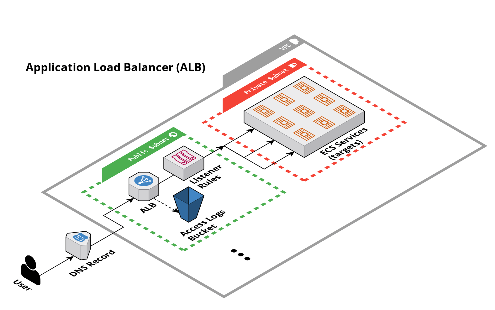

# Application Load Balancer (ALB)

## Overview

This module contains the Terraform code to deploy an ALB on [AWS](https://aws.amazon.com/) using [Elastic Load Balancing (ELB)](https://docs.aws.amazon.com/elasticloadbalancing/latest/application/introduction.html).

<!-- Image or Arch diagram -->


## Learn

Elastic Load Balancing automatically distributes your incoming traffic across multiple targets, such as EC2 instances, containers, and IP addresses, in one or more Availability Zones. It monitors the health of its registered targets, and routes traffic only to the healthy targets. Elastic Load Balancing scales your load balancer as your incoming traffic changes over time. It can automatically scale to the vast majority of workloads.

For more information about when and why ALBs should be used review the [Application Load Balancer Overview](https://docs.aws.amazon.com/elasticloadbalancing/latest/application/introduction.html#application-load-balancer-overview).

The module is developed to support HTTP/HTTPS traffic to a target. The module creates the listeners and DNS records that can be used to route traffic to the ALB. It is the responsibility of the user to create and manage the target group and targets that the ALB will route traffic to. The targets can be associated to the listeners using listeners rules.

Additional recommended readings include:

- [Listener and Listener Rules](https://docs.aws.amazon.com/elasticloadbalancing/latest/application/load-balancer-listeners.html)
- [Target Groups](https://docs.aws.amazon.com/elasticloadbalancing/latest/application/load-balancer-target-groups.html)
- [ALB Access Logs](https://docs.aws.amazon.com/elasticloadbalancing/latest/application/load-balancer-access-logs.html)
- [Troubleshooting ALB](https://docs.aws.amazon.com/elasticloadbalancing/latest/application/load-balancer-troubleshooting.html)

<!-- BEGIN_TF_DOCS -->
## Requirements

| Name | Version |
|------|---------|
| <a name="requirement_terraform"></a> [terraform](#requirement\_terraform) | >= 1.5.5 |
| <a name="requirement_aws"></a> [aws](#requirement\_aws) | >= 5.0 |

## Sample Usage

```hcl
module "example" {


	 source  = "github.com/Cyber4All/terraform-cyber4all-catalog//modules/<REPLACE_WITH_MODULE>?ref=v<REPLACE_WITH_VERSION>"


	 # --------------------------------------------
	 # Required variables
	 # --------------------------------------------


	 # The name of the ALB.
	 alb_name  = string


	 # The VPC ID where the ALB will be created.
	 vpc_id  = string


	 # The ids of the subnets that the ALB can use to source its IP.
	 vpc_subnet_ids  = list(string)


	 # --------------------------------------------
	 # Optional variables
	 # --------------------------------------------


	 # The prefix of the DNS A record that will be created for the ALB.
	 dns_record_prefix  = string


	 # Creates an HTTPS listener for the ALB. When enabled the ALB will redirect HTTP traffic to HTTPS automatically.
	 enable_https_listener  = bool


	 # The name of the hosted zone where the ALB DNS record will be created.
	 hosted_zone_name  = string


}
```
## Inputs

| Name | Description | Type | Default | Required |
|------|-------------|------|---------|:--------:|
| <a name="input_alb_name"></a> [alb\_name](#input\_alb\_name) | The name of the ALB. | `string` | n/a | yes |
| <a name="input_dns_record_prefix"></a> [dns\_record\_prefix](#input\_dns\_record\_prefix) | The prefix of the DNS A record that will be created for the ALB. | `string` | `"api"` | no |
| <a name="input_enable_https_listener"></a> [enable\_https\_listener](#input\_enable\_https\_listener) | Creates an HTTPS listener for the ALB. When enabled the ALB will redirect HTTP traffic to HTTPS automatically. | `bool` | `true` | no |
| <a name="input_hosted_zone_name"></a> [hosted\_zone\_name](#input\_hosted\_zone\_name) | The name of the hosted zone where the ALB DNS record will be created. | `string` | `""` | no |
| <a name="input_vpc_id"></a> [vpc\_id](#input\_vpc\_id) | The VPC ID where the ALB will be created. | `string` | n/a | yes |
| <a name="input_vpc_subnet_ids"></a> [vpc\_subnet\_ids](#input\_vpc\_subnet\_ids) | The ids of the subnets that the ALB can use to source its IP. | `list(string)` | n/a | yes |
## Outputs

| Name | Description |
|------|-------------|
| <a name="output_alb_arn"></a> [alb\_arn](#output\_alb\_arn) | The ARN of the ALB. |
| <a name="output_alb_dns_name"></a> [alb\_dns\_name](#output\_alb\_dns\_name) | The DNS name of the ALB. |
| <a name="output_alb_dns_record_name"></a> [alb\_dns\_record\_name](#output\_alb\_dns\_record\_name) | The name of the ALB DNS record. |
| <a name="output_alb_hosted_zone_id"></a> [alb\_hosted\_zone\_id](#output\_alb\_hosted\_zone\_id) | The ID of the hosted zone where the ALB DNS record was created. |
| <a name="output_alb_name"></a> [alb\_name](#output\_alb\_name) | The name of the ALB. |
| <a name="output_alb_security_group_id"></a> [alb\_security\_group\_id](#output\_alb\_security\_group\_id) | The ID of the ALB security group. |
| <a name="output_http_listener_arn"></a> [http\_listener\_arn](#output\_http\_listener\_arn) | The ARN of the HTTP listener. |
| <a name="output_https_listener_arn"></a> [https\_listener\_arn](#output\_https\_listener\_arn) | The ARN of the HTTPS listener. |
<!-- END_TF_DOCS -->