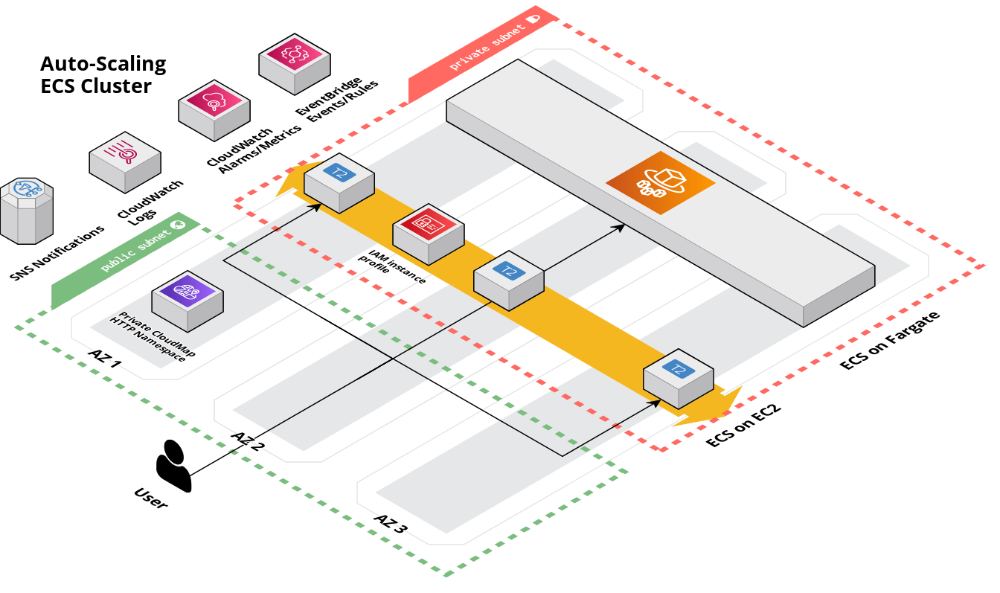

# Elastic Container Service (ECS) Cluster

## Overview

This module contains Terraform code to deploy an ECS cluster on [AWS](https://aws.amazon.com/) using [Elastic Container Service (ECS)](https://docs.aws.amazon.com/AmazonECS/latest/developerguide/Welcome.html).

This service launches an ECS cluster on top of an Auto Scaling Group that you manage. If you wish to launch an ECS cluster on top of Fargate that is completely managed by AWS, specify the FARGATE provider for ECS services being associated to the cluster. Refer to the section EC2 vs Fargate Launch Types for more information on the differences between the two compute options.

<!-- Image or Arch diagram -->



## Learn

<!-- A few references to ECS (documentation, blog, etc...) -->

ECS is an orchestration agent that runs on either EC2 container instances or FARGATE (AWS serverless compute option). Container instances can be created individually, or managed with an Auto Scaling group. For more information about container instance configruation review the [launch container instance documentation](https://docs.aws.amazon.com/AmazonECS/latest/developerguide/launch_container_instance.html).

Cluster auto scaling is configured by the ecs-cluster module. The cluster contains a list of capacity providers. The capacity providers can either be custom EC2 autoscaling groups, or from the set providers, i.e FARGATE. This ecs-cluster module creates an EC2 auto scaling group as the default provider strategy and offers FARGATE as a secondary provider option. The variables for the module can be overriden to update the cluster auto scaling. Prior to setting cluster auto scaling configuration review the [AWS documentation for considerations](https://docs.aws.amazon.com/AmazonECS/latest/developerguide/cluster-auto-scaling.html).

Additional recommended readings include:

- [Managing Compute for AWS ECS Clusters with Capacity Providers](https://aws.amazon.com/blogs/containers/managing-compute-for-amazon-ecs-clusters-with-capacity-providers/)
- [Deep Dive on AWS ECS Cluster Auto Scaling](https://aws.amazon.com/blogs/containers/deep-dive-on-amazon-ecs-cluster-auto-scaling/)

<!-- BEGIN_TF_DOCS -->
## Requirements

The following requirements are needed by this module:

- <a name="requirement_terraform"></a> [terraform](#requirement\_terraform) (>= 1.5.5)

- <a name="requirement_aws"></a> [aws](#requirement\_aws) (>= 5.0)

## Sample Usage

```hcl
module "example" {


	 source  = "github.com/Cyber4All/terraform-cyber4all-catalog//modules/<REPLACE_WITH_MODULE>?ref=v<REPLACE_WITH_VERSION>"


	 # --------------------------------------------
	 # Required variables
	 # --------------------------------------------


	 # The name of the ECS cluster.
	 cluster_name  = string


	 # The ID of the VPC in which the ECS cluster should be launched.
	 vpc_id  = string


	 # The IDs of the subnets in which to deploy the ECS cluster instances.
	 vpc_subnet_ids  = list(string)


	 # --------------------------------------------
	 # Optional variables
	 # --------------------------------------------


	 # The ARNs of SNS topics where failed Autoscaling notifications should be sent to.
	 autoscaling_sns_topic_arns  = list(string)


	 # Protect EC2 instances running ECS tasks from being terminated due to scale in (spot instances do not support lifecycle modifications). Note that the behavior of termination protection differs between clusters with capacity providers and clusters without. When capacity providers is turned on and this flag is true, only instances that have 0 ECS tasks running will be scaled in, regardless of capacity_provider_target. If capacity providers is turned off and this flag is true, this will prevent ANY instances from being scaled in.
	 autoscaling_termination_protection  = bool


	 # Maximum step adjustment size to the ASG's desired instance count. A number between 1 and 10000. It is better to overestimate this value.
	 capacity_provider_max_scale_step  = number


	 # Minimum step adjustment size to the ASG's desired instance count. A number between 1 and 10000. It is better to underestimate this value.
	 capacity_provider_min_scale_step  = number


	 # Target cluster utilization for the ASG capacity provider; a number from 1 to 100. This number influences when scale out happens, and when instances should be scaled in. For example, a setting of 90 means that new instances will be provisioned when all instances are at 90% utilization, while instances that are only 10% utilized (CPU and Memory usage from tasks = 10%) will be scaled in.
	 capacity_provider_target  = number


	 # Specify a list of ECS Cluster TCP ports which should be made accessible through ingress traffic.
	 cluster_ingress_access_ports  = list(number)


	 # The AMI to run on each instance in the ECS cluster.
	 cluster_instance_ami  = string


	 # The size of the EC2 instance.
	 cluster_instance_type  = string


	 # The maximum number of instances to run in the ECS cluster.
	 cluster_max_size  = number


	 # The minimum number of instances to run in the ECS cluster
	 cluster_min_size  = number


}
```
## Required Inputs

The following input variables are required:

### <a name="input_cluster_name"></a> [cluster\_name](#input\_cluster\_name)

Description: The name of the ECS cluster.

Type: `string`

### <a name="input_vpc_id"></a> [vpc\_id](#input\_vpc\_id)

Description: The ID of the VPC in which the ECS cluster should be launched.

Type: `string`

### <a name="input_vpc_subnet_ids"></a> [vpc\_subnet\_ids](#input\_vpc\_subnet\_ids)

Description: The IDs of the subnets in which to deploy the ECS cluster instances.

Type: `list(string)`

## Optional Inputs

The following input variables are optional (have default values):

### <a name="input_autoscaling_sns_topic_arns"></a> [autoscaling\_sns\_topic\_arns](#input\_autoscaling\_sns\_topic\_arns)

Description: The ARNs of SNS topics where failed Autoscaling notifications should be sent to.

Type: `list(string)`

Default: `[]`

### <a name="input_autoscaling_termination_protection"></a> [autoscaling\_termination\_protection](#input\_autoscaling\_termination\_protection)

Description: Protect EC2 instances running ECS tasks from being terminated due to scale in (spot instances do not support lifecycle modifications). Note that the behavior of termination protection differs between clusters with capacity providers and clusters without. When capacity providers is turned on and this flag is true, only instances that have 0 ECS tasks running will be scaled in, regardless of capacity\_provider\_target. If capacity providers is turned off and this flag is true, this will prevent ANY instances from being scaled in.

Type: `bool`

Default: `true`

### <a name="input_capacity_provider_max_scale_step"></a> [capacity\_provider\_max\_scale\_step](#input\_capacity\_provider\_max\_scale\_step)

Description: Maximum step adjustment size to the ASG's desired instance count. A number between 1 and 10000. It is better to overestimate this value.

Type: `number`

Default: `2`

### <a name="input_capacity_provider_min_scale_step"></a> [capacity\_provider\_min\_scale\_step](#input\_capacity\_provider\_min\_scale\_step)

Description: Minimum step adjustment size to the ASG's desired instance count. A number between 1 and 10000. It is better to underestimate this value.

Type: `number`

Default: `1`

### <a name="input_capacity_provider_target"></a> [capacity\_provider\_target](#input\_capacity\_provider\_target)

Description: Target cluster utilization for the ASG capacity provider; a number from 1 to 100. This number influences when scale out happens, and when instances should be scaled in. For example, a setting of 90 means that new instances will be provisioned when all instances are at 90% utilization, while instances that are only 10% utilized (CPU and Memory usage from tasks = 10%) will be scaled in.

Type: `number`

Default: `100`

### <a name="input_cluster_ingress_access_ports"></a> [cluster\_ingress\_access\_ports](#input\_cluster\_ingress\_access\_ports)

Description: Specify a list of ECS Cluster TCP ports which should be made accessible through ingress traffic.

Type: `list(number)`

Default: `[]`

### <a name="input_cluster_instance_ami"></a> [cluster\_instance\_ami](#input\_cluster\_instance\_ami)

Description: The AMI to run on each instance in the ECS cluster.

Type: `string`

Default: `"ami-011425496927b80c0"`

### <a name="input_cluster_instance_type"></a> [cluster\_instance\_type](#input\_cluster\_instance\_type)

Description: The size of the EC2 instance.

Type: `string`

Default: `"t2.micro"`

### <a name="input_cluster_max_size"></a> [cluster\_max\_size](#input\_cluster\_max\_size)

Description: The maximum number of instances to run in the ECS cluster.

Type: `number`

Default: `3`

### <a name="input_cluster_min_size"></a> [cluster\_min\_size](#input\_cluster\_min\_size)

Description: The minimum number of instances to run in the ECS cluster

Type: `number`

Default: `1`
## Outputs

The following outputs are exported:

### <a name="output_ecs_cluster_arn"></a> [ecs\_cluster\_arn](#output\_ecs\_cluster\_arn)

Description: The ARN of the ECS cluster.

### <a name="output_ecs_cluster_asg_name"></a> [ecs\_cluster\_asg\_name](#output\_ecs\_cluster\_asg\_name)

Description: The name of the ECS cluster's Auto Scaling Group.

### <a name="output_ecs_cluster_capacity_provider_name"></a> [ecs\_cluster\_capacity\_provider\_name](#output\_ecs\_cluster\_capacity\_provider\_name)

Description: The name of the ECS cluster's capacity provider.

### <a name="output_ecs_cluster_launch_template_id"></a> [ecs\_cluster\_launch\_template\_id](#output\_ecs\_cluster\_launch\_template\_id)

Description: The ID of the ECS cluster's launch template.

### <a name="output_ecs_cluster_name"></a> [ecs\_cluster\_name](#output\_ecs\_cluster\_name)

Description: The name of the ECS cluster.

### <a name="output_ecs_cluster_vpc_subnet_ids"></a> [ecs\_cluster\_vpc\_subnet\_ids](#output\_ecs\_cluster\_vpc\_subnet\_ids)

Description: The IDs of the ECS cluster's VPC subnets.

### <a name="output_ecs_instance_iam_role_arn"></a> [ecs\_instance\_iam\_role\_arn](#output\_ecs\_instance\_iam\_role\_arn)

Description: The ARN of the IAM role applied to ECS instances.

### <a name="output_ecs_instance_iam_role_id"></a> [ecs\_instance\_iam\_role\_id](#output\_ecs\_instance\_iam\_role\_id)

Description: The ID of the IAM role applied to ECS instances.

### <a name="output_ecs_instance_iam_role_name"></a> [ecs\_instance\_iam\_role\_name](#output\_ecs\_instance\_iam\_role\_name)

Description: The name of the IAM role applied to ECS instances.

### <a name="output_ecs_instance_security_group_id"></a> [ecs\_instance\_security\_group\_id](#output\_ecs\_instance\_security\_group\_id)

Description: The ID of the security group applied to ECS instances.
<!-- END_TF_DOCS -->