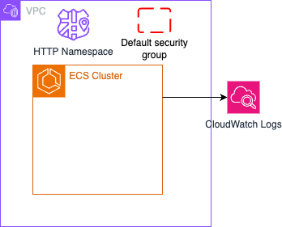

# Elastic Container Service (ECS) Cluster

## Overview

This module contains Terraform code to deploy an ECS cluster on [AWS](https://aws.amazon.com/) using [Elastic Container Service (ECS)](https://docs.aws.amazon.com/AmazonECS/latest/developerguide/Welcome.html).

This module launches an ECS cluster using Fargate that is completely managed by AWS.

<!-- Image or Arch diagram -->



## Learn

<!-- A few references to ECS (documentation, blog, etc...) -->

ECS is an orchestration agent that runs on either EC2 container instances or FARGATE (AWS serverless compute option). Container instances can be created individually, or managed with an Auto Scaling group. For more information about container instance configruation review the [launch container instance documentation](https://docs.aws.amazon.com/AmazonECS/latest/developerguide/launch_container_instance.html).

The cluster contains a list of capacity providers. The capacity providers provide the compute layer for the cluster the following capacity providers include: EC2 autoscaling groups, FARGATE, or FARGATE_SPOT. This ecs-cluster module uses FARGATE as the primary provider option. This means that AWS manages the compute layer and the user does not need to worry about the underlying infrastructure.

Additional recommended readings include:

- [Managing Compute for AWS ECS Clusters with Capacity Providers](https://aws.amazon.com/blogs/containers/managing-compute-for-amazon-ecs-clusters-with-capacity-providers/)

<!-- BEGIN_TF_DOCS -->
## Requirements

The following requirements are needed by this module:

- <a name="requirement_terraform"></a> [terraform](#requirement\_terraform) (>= 1.5.5)

- <a name="requirement_aws"></a> [aws](#requirement\_aws) (>= 5.0)
## Sample Usage
```hcl
terraform {
	 source = "github.com/Cyber4All/terraform-cyber4all-catalog//modules/<REPLACE_WITH_MODULE>?ref=v<REPLACE_WITH_VERSION>"
}

inputs = {


  	 # --------------------------------------------
  	 # Required variables
  	 # --------------------------------------------
  

    	 cluster_name  = string
    

    	 vpc_id  = string
    

}
```
## Required Inputs

The following input variables are required:

### <a name="input_cluster_name"></a> [cluster\_name](#input\_cluster\_name)

Description: The name of the ECS cluster.

Type: `string`

### <a name="input_vpc_id"></a> [vpc\_id](#input\_vpc\_id)

Description: The ID of the VPC in which the ECS cluster should be launched.

Type: `string`
## Outputs

The following outputs are exported:

### <a name="output_ecs_cluster_arn"></a> [ecs\_cluster\_arn](#output\_ecs\_cluster\_arn)

Description: The ARN of the ECS cluster.

### <a name="output_ecs_cluster_name"></a> [ecs\_cluster\_name](#output\_ecs\_cluster\_name)

Description: The name of the ECS cluster.
<!-- END_TF_DOCS -->
