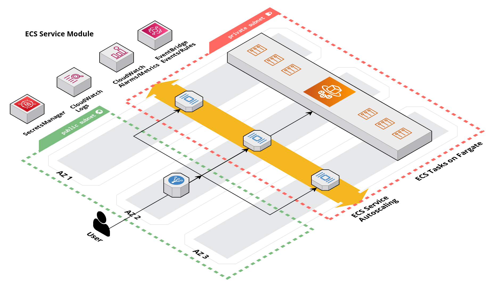

# Elastic Container Service (ECS) Module

<details>
<summary><strong>Table of Contents</strong></summary>

- [Elastic Container Service (ECS) Module](#elastic-container-service-ecs-module)
	- [Overview](#overview)
	- [Learn](#learn)
		- [ECS Task Definition](#ecs-task-definition)
			- [Container Definitions](#container-definitions)
				- [Essential Container Definition](#essential-container-definition)
			- [Task Execution Role](#task-execution-role)
			- [Task Role](#task-role)
			- [Container Logging](#container-logging)
			- [Container Environment Variables](#container-environment-variables)
				- [Secrets Manager](#secrets-manager)
		- [ECS Service](#ecs-service)
			- [Bootstrapping Images in Deployments](#bootstrapping-images-in-deployments)
			- [Service Autoscaling](#service-autoscaling)
				- [Target Tracking Policy](#target-tracking-policy)
				- [Cluster Scaling](#cluster-scaling)
				- [Minimum and Maximum Task Limits](#minimum-and-maximum-task-limits)
				- [`desired_number_of_tasks` Variable](#desired_number_of_tasks-variable)
			- [ECS Service Connect](#ecs-service-connect)
			- [ECS Service Rolling Deployment](#ecs-service-rolling-deployment)
		- [ECS Scheduled Task](#ecs-scheduled-task)
			- [Cron Expressions](#cron-expressions)
			- [Event Patterns](#event-patterns)

</details>

## Overview

This module contains Terraform code to deploy an ECS service on [AWS](https://aws.amazon.com/) using [Elastic Container Service (ECS)](https://docs.aws.amazon.com/AmazonECS/latest/developerguide/Welcome.html).

This service deploys an [ECS service](https://docs.aws.amazon.com/AmazonECS/latest/developerguide/ecs_services.html) or [scheduled task](https://docs.aws.amazon.com/AmazonECS/latest/developerguide/scheduled_tasks.html) on an existing [ECS cluster]([../ecs-cluster/README.md](https://github.com/Cyber4All/terraform-cyber4all-catalog/blob/main/modules/ecs-cluster/README.md)). An ECS service is a long-running task typically deployed with [auto-scaling](https://docs.aws.amazon.com/AmazonECS/latest/developerguide/service-auto-scaling.html) enabled, often used for applications like REST APIs. A scheduled task is a batch task expected to exit gracefully after execution, ideal for tasks such as daily reporting scripts. This module can deploy either task type.

<!-- Image or Arch diagram -->



## Learn

### ECS Task Definition

The ECS [task definition](https://docs.aws.amazon.com/AmazonECS/latest/developerguide/task_definitions.html) is a fundamental component of ECS, containing configurations for resource requirements, container definitions, and other deployment settings. It serves as the blueprint for both ECS services and scheduled tasks.

An ECS task definition is organized into families which consist of multiple revisions of a given task definition. Using the blueprint analogy, these are like different versions of the blueprint.

#### Container Definitions

The heart of the task definition are the [container definitions](https://docs.aws.amazon.com/AmazonECS/latest/APIReference/API_ContainerDefinition.html). These configurations define the container deployed as part of the ECS task, including the image, environment variables, secrets, and other container settings. Many of these options are similar to docker run flags. You can find detailed information in the [ECS container definition documentation](https://docs.aws.amazon.com/AmazonECS/latest/developerguide/task_definition_parameters.html#container_definitions) for more information.

##### Essential Container Definition

The essential container definition is the primary container deployed as part of the ECS task and is required for all ECS tasks. The ECS service module supports a single essential container definition. If you need to deploy multiple containers within a task, contact the module maintainers to add support for this feature.

#### Task Execution Role

The [ECS task execution](https://docs.aws.amazon.com/AmazonECS/latest/developerguide/task_execution_IAM_role.html) role is an IAM role granting permissions to the ECS task during provisioning. This module assigns the `AmazonECSTaskExecutionRolePolicy` policy by default, and additional policies, such as access to Secrets Manager secrets, can be attached using the `ecs_container_secrets` and `docker_credential_secretsmanager_arn` variables.

#### Task Role

The [ECS task role](https://docs.aws.amazon.com/AmazonECS/latest/developerguide/task-iam-roles.html) is an IAM role granting permissions to the ECS task at runtime. By default, no policies are attached, but you can add policies using the `ecs_task_role_policy_arns` variable. This may be necessary if the ECS task needs to access other AWS services like S3 or SNS.

#### Container Logging

Container logging can be enabled to send container (application) logs to [CloudWatch Logs](https://docs.aws.amazon.com/AmazonCloudWatch/latest/logs/WhatIsCloudWatchLogs.html), useful for debugging and monitoring. Use the `enable_container_logs` variable to enable or disable this feature. Enabling this feature will provision the necessary resources to send logs to CloudWatch Logs automatically.

#### Container Environment Variables

You can configure non-sensitive environment variables defined in the container definition using the `ecs_container_environment_variables` variable, which is a map of variable names to values. An example of setting environment variables is shown below.

```hcl
module "example" {
  # ...

  ecs_container_environment_variables = { 
    ENV_VAR_1 = "value1"
    ENV_VAR_2 = "value2"
  }

  # ...
}
```

##### Secrets Manager

Sensitive environment variables can be injected using the `ecs_container_secrets` variable, which maps variable names to AWS [Secrets Manager](https://github.com/Cyber4All/terraform-cyber4all-catalog/blob/main/modules/secrets-manager/README.md) secret ARNs. **The assumption made by this module is that the name of the secret is the same as the name of the environment variable.** Unintended behavior will occur is this assumption is broken. The module automatically handles the injection of secret values into the container at runtime. An example of setting secrets is shown below.

```hcl
module "example" {
  # ...

  ecs_container_secrets = { 
    SECRET_VAR_1 = "arn:aws:secretsmanager:us-east-1:123456789012:secret:my-secret-1"
    SECRET_VAR_2 = "arn:aws:secretsmanager:us-east-1:123456789012:secret:my-secret-2"
  }

  # ...
}
```

### ECS Service

#### Bootstrapping Images in Deployments

When deploying an ECS service for the first time, the ECS service module bootstraps the container image specified by the `ecs_container_image` variable. Subsequent updates to the Terraform configuration should unset or comment out the `ecs_container_image` variable to allow external application deployments to manage image updates.

An example of the bootstrapping workflow of an image is shown below:

1. Initial deployment of the ECS service with `ecs_container_image` set to `my-image:1.0.0`.

```hcl
module "example" {
  # ...

  ecs_container_image = "my-image:1.0.0"

  # ...
}
```

2. Application image externally deployed with tag `my-image:1.1.0` to ECS service.

3. Some arbitrary change needs to be made to the ECS service. The `ecs_container_image` variable MUST BE unset or commented out to prevent overriding the external deployment.

```hcl
module "example" {
    # ...

    # ecs_container_image declaration removed

    # ...
    # arbitrary changes
}
```

4. Terraform apply provisions the arbitrary changes and uses the image tag specified from the external deployment of the ECS service automatically.

#### Service Autoscaling

[ECS service autoscaling](https://docs.aws.amazon.com/AmazonECS/latest/developerguide/service-auto-scaling.html) is a feature that allows you to automatically adjust the number of tasks running in your ECS service based on the workload. It's important to note that autoscaling is only supported for ECS service types, not for scheduled tasks.

- [ECS Service Autoscaling](https://docs.aws.amazon.com/AmazonECS/latest/developerguide/service-auto-scaling.html)
- [ECS CloudWatch Metrics Service Utilization](https://docs.aws.amazon.com/AmazonECS/latest/developerguide/cloudwatch-metrics.html#service_utilization)
- [Load testing ECS application](https://ecsworkshop.com/monitoring/container_insights/performloadtest/)

##### Target Tracking Policy

This module uses a [target tracking policy](https://docs.aws.amazon.com/AmazonECS/latest/developerguide/service-autoscaling-targettracking.html) to manage autoscaling. This policy is based on the average memory utilization of your ECS service. By default, the threshold for scaling is set at 50% utilization, but you can customize it by adjusting the `auto_scaling_memory_util_threshold` variable.

When your service consistently exceeds the threshold for a specific period of time, it will **scale out**, adding more tasks to handle the increased workload. Conversely, when your service remains below the threshold for a specific period, it will **scale in**, removing unneeded tasks to save resources.

##### Cluster Scaling

If your ECS cluster lacks the necessary resources to scale out, your service will wait until the cluster has enough resources available. [Cluster scaling](https://docs.aws.amazon.com/AmazonECS/latest/developerguide/cluster-auto-scaling.html) is managed by the ECS cluster's auto scaling group. It's essential to understand that ECS service and ECS cluster autoscaling configurations are separate.

##### Minimum and Maximum Task Limits

Your ECS service will only scale out to the number of tasks specified by the `auto_scaling_max_number_of_tasks` variable. Similarly, it will only scale in to the number of tasks specified by the `auto_scaling_min_number_of_tasks` variable. The default values for these variables are 4 and 1, respectively.

##### `desired_number_of_tasks` Variable

The `desired_number_of_tasks` variable is used to set the initial number of tasks when deploying a service or scheduling a task. It's important to note that this variable is evaluated within the range defined by the minimum and maximum task limits for autoscaling.

Keep in mind that ECS service autoscaling is a powerful feature that automatically adjusts your service's capacity based on real-time performance metrics, ensuring optimal resource utilization and application responsiveness.

#### ECS Service Connect

[ECS service connect](https://docs.aws.amazon.com/AmazonECS/latest/developerguide/service-connect.html) enables easy communication between tasks. Set the `enable_service_connect` variable to `true` to enable this feature, available for ECS service types.

Service connect replaces the [ECS service discovery](https://docs.aws.amazon.com/AmazonECS/latest/developerguide/service-discovery.html) feature and creates a private DNS namespace for ECS services to share. It allows services to communicate using the `service-name:container-port` format as the hostname.

- [ECS service connect](https://aws.amazon.com/blogs/aws/new-amazon-ecs-service-connect-enabling-easy-communication-between-microservices/)
- [Service Connect Documentation](https://docs.aws.amazon.com/AmazonECS/latest/developerguide/service-connect-concepts.html)

#### ECS Service Rolling Deployment

[ECS service rolling deployment](https://docs.aws.amazon.com/AmazonECS/latest/developerguide/deployment-type-ecs.html) enables zero-downtime updates of your service. When an update is made, tasks are provisioned, and once they are registered as HEALTHY, old tasks are removed. Deployment failures can trigger rollback if `enable_deployment_rollback` is set to `true`.

Deployment failures are marked when tasks fail to reach a steady state, defined by the minimum threshold of 10 tasks. This ensures that deployments proceed smoothly.

- [ECS Rolling Deployment Circuit Breaker](https://docs.aws.amazon.com/AmazonECS/latest/developerguide/deployment-circuit-breaker.html)
- [Speeding up ECS deployments](https://docs.aws.amazon.com/AmazonECS/latest/bestpracticesguide/deployment.html)

### ECS Scheduled Task

#### Cron Expressions

[Cron expressions reference](https://docs.aws.amazon.com/eventbridge/latest/userguide/eb-cron-expressions.html)
[Rate expression reference](https://docs.aws.amazon.com/eventbridge/latest/userguide/eb-rate-expressions.html)

#### Event Patterns

[Custom event pattern reference](https://docs.aws.amazon.com/eventbridge/latest/userguide/eb-events-structure.html)
[Amazon EventBridge events](https://docs.aws.amazon.com/eventbridge/latest/userguide/eb-events.html)

<!-- BEGIN_TF_DOCS -->
## Requirements

The following requirements are needed by this module:

- <a name="requirement_terraform"></a> [terraform](#requirement\_terraform) (>= 1.5.5)

- <a name="requirement_aws"></a> [aws](#requirement\_aws) (>= 5.0)

- <a name="requirement_random"></a> [random](#requirement\_random) (>= 3.5.1)
## Sample Usage
```hcl
terraform {
	 source = "github.com/Cyber4All/terraform-cyber4all-catalog//modules/<REPLACE_WITH_MODULE>?ref=v<REPLACE_WITH_VERSION>"
}

inputs = {


	 # --------------------------------------------
	 # Required variables
	 # --------------------------------------------


	 ecs_cluster_name  = string


	 ecs_service_name  = string


	 # --------------------------------------------
	 # Optional variables
	 # --------------------------------------------


	 auto_scaling_max_number_of_tasks  = number


	 auto_scaling_memory_util_threshold  = number


	 auto_scaling_min_number_of_tasks  = number


	 create_scheduled_task  = bool


	 desired_number_of_tasks  = number


	 docker_credential_secretsmanager_arn  = string


	 ecs_container_environment_variables  = map(string)


	 ecs_container_image  = string


	 ecs_container_port  = number


	 ecs_container_secrets  = map(string)


	 ecs_task_cpu  = number


	 ecs_task_ephemeral_storage  = number


	 ecs_task_memory  = number


	 ecs_task_role_policy_arns  = list(string)


	 enable_container_logs  = bool


	 enable_deployment_rollback  = bool


	 enable_load_balancer  = bool


	 enable_service_auto_scaling  = bool


	 enable_service_connect  = bool


	 lb_listener_arn  = string


	 lb_target_group_vpc_id  = string


	 scheduled_task_assign_public_ip  = bool


	 scheduled_task_cron_expression  = string


	 scheduled_task_event_pattern  = any


	 scheduled_task_security_group_ids  = list(string)


	 scheduled_task_subnet_ids  = list(string)


}
```
## Required Inputs

The following input variables are required:

### <a name="input_ecs_cluster_name"></a> [ecs\_cluster\_name](#input\_ecs\_cluster\_name)

Description: The name of the ECS cluster.

Type: `string`

### <a name="input_ecs_service_name"></a> [ecs\_service\_name](#input\_ecs\_service\_name)

Description: The name of the ECS service.

Type: `string`

## Optional Inputs

The following input variables are optional (have default values):

### <a name="input_auto_scaling_max_number_of_tasks"></a> [auto\_scaling\_max\_number\_of\_tasks](#input\_auto\_scaling\_max\_number\_of\_tasks)

Description: The maximum number of instances of the ECS service to run across the ECS cluster. Auto scaling will not scale beyond this number.

Type: `number`

Default: `4`

### <a name="input_auto_scaling_memory_util_threshold"></a> [auto\_scaling\_memory\_util\_threshold](#input\_auto\_scaling\_memory\_util\_threshold)

Description: The percentage for the ECS service's average Memory utilization threshold. The service uses a target tracking scaling policy.

Type: `number`

Default: `50`

### <a name="input_auto_scaling_min_number_of_tasks"></a> [auto\_scaling\_min\_number\_of\_tasks](#input\_auto\_scaling\_min\_number\_of\_tasks)

Description: The minimum number of instances of the ECS service to run across the ECS cluster. Auto scaling will not scale below this number.

Type: `number`

Default: `1`

### <a name="input_create_scheduled_task"></a> [create\_scheduled\_task](#input\_create\_scheduled\_task)

Description: The ECS task should be deployed as a scheduled task rather than a managed ECS service.

Type: `bool`

Default: `false`

### <a name="input_desired_number_of_tasks"></a> [desired\_number\_of\_tasks](#input\_desired\_number\_of\_tasks)

Description: The number of instances of the ECS service or scheduled task to run across the ECS cluster.

Type: `number`

Default: `1`

### <a name="input_docker_credential_secretsmanager_arn"></a> [docker\_credential\_secretsmanager\_arn](#input\_docker\_credential\_secretsmanager\_arn)

Description: The ARN of the AWS Secrets Manager secret containing the Docker credentials.

Type: `string`

Default: `""`

### <a name="input_ecs_container_environment_variables"></a> [ecs\_container\_environment\_variables](#input\_ecs\_container\_environment\_variables)

Description: A map of environment variables to set in the ECS container definition. The key is the name of the environment variable and the value is the value of the environment variable. These values should NOT be sensitive.

Type: `map(string)`

Default: `{}`

### <a name="input_ecs_container_image"></a> [ecs\_container\_image](#input\_ecs\_container\_image)

Description: The name and tag of the docker image to use for the ECS essential container definition. If this value is not set, it will try and pull the currently deployed container image. This allows for external application deployments to be managed outside of Terraform. This value is required for initial deployments and when changing the base image (image without the tag).

Type: `string`

Default: `""`

### <a name="input_ecs_container_port"></a> [ecs\_container\_port](#input\_ecs\_container\_port)

Description: The container port that the application is listening on.

Type: `number`

Default: `3000`

### <a name="input_ecs_container_secrets"></a> [ecs\_container\_secrets](#input\_ecs\_container\_secrets)

Description: A map of secrets to configure in the ECS container definition. The key is the name of the environment variable and the value is the ARN of the Secrets Manager secret that contains the environment variable. It is assumed that the secret's value can be indexed using the environment variable name. These are environment variables that are sensitive and should not be stored in plain text.

Type: `map(string)`

Default: `{}`

### <a name="input_ecs_task_cpu"></a> [ecs\_task\_cpu](#input\_ecs\_task\_cpu)

Description: The amount of CPU (in units) to allocate to the ECS task.

Type: `number`

Default: `256`

### <a name="input_ecs_task_ephemeral_storage"></a> [ecs\_task\_ephemeral\_storage](#input\_ecs\_task\_ephemeral\_storage)

Description: The amount of ephemeral storage (in GiB) to allocate to the ECS task.

Type: `number`

Default: `21`

### <a name="input_ecs_task_memory"></a> [ecs\_task\_memory](#input\_ecs\_task\_memory)

Description: The amount of memory (in MiB) to allocate to the ECS task.

Type: `number`

Default: `256`

### <a name="input_ecs_task_role_policy_arns"></a> [ecs\_task\_role\_policy\_arns](#input\_ecs\_task\_role\_policy\_arns)

Description: A list of ARNs of IAM policies to attach to the ECS task role.

Type: `list(string)`

Default: `[]`

### <a name="input_enable_container_logs"></a> [enable\_container\_logs](#input\_enable\_container\_logs)

Description: Enable container logging to CloudWatch Logs.

Type: `bool`

Default: `true`

### <a name="input_enable_deployment_rollback"></a> [enable\_deployment\_rollback](#input\_enable\_deployment\_rollback)

Description: Enable rollback of a FAILED deployment if a service cannot reach a steady state.

Type: `bool`

Default: `true`

### <a name="input_enable_load_balancer"></a> [enable\_load\_balancer](#input\_enable\_load\_balancer)

Description: Enable a load balancer for the ECS service. This will create an ALB target for the ECS service that is attached to an existing ALB.

Type: `bool`

Default: `false`

### <a name="input_enable_service_auto_scaling"></a> [enable\_service\_auto\_scaling](#input\_enable\_service\_auto\_scaling)

Description: Enable auto scaling of the ECS service.

Type: `bool`

Default: `true`

### <a name="input_enable_service_connect"></a> [enable\_service\_connect](#input\_enable\_service\_connect)

Description: Enable service connect for the ECS service.

Type: `bool`

Default: `true`

### <a name="input_lb_listener_arn"></a> [lb\_listener\_arn](#input\_lb\_listener\_arn)

Description: The load balancer listener arn to attach the ECS service to. This value is required when enable\_load\_balancer is true.

Type: `string`

Default: `""`

### <a name="input_lb_target_group_vpc_id"></a> [lb\_target\_group\_vpc\_id](#input\_lb\_target\_group\_vpc\_id)

Description: The VPC id to deploy the ECS service's load balancer traget group into. Required when enable\_load\_balancer is true.

Type: `string`

Default: `""`

### <a name="input_scheduled_task_assign_public_ip"></a> [scheduled\_task\_assign\_public\_ip](#input\_scheduled\_task\_assign\_public\_ip)

Description: Assign a public IP address to the ECS task.

Type: `bool`

Default: `true`

### <a name="input_scheduled_task_cron_expression"></a> [scheduled\_task\_cron\_expression](#input\_scheduled\_task\_cron\_expression)

Description: The cron expression to use for the scheduled task. If create scheduled task is true and no event pattern is provided, then the cron is expected.

Type: `string`

Default: `""`

### <a name="input_scheduled_task_event_pattern"></a> [scheduled\_task\_event\_pattern](#input\_scheduled\_task\_event\_pattern)

Description: The event pattern to use for the scheduled task. If create scheduled task is true and no cron expression is provided, then the event pattern is expected.

Type: `any`

Default: `null`

### <a name="input_scheduled_task_security_group_ids"></a> [scheduled\_task\_security\_group\_ids](#input\_scheduled\_task\_security\_group\_ids)

Description: A list of security group IDs to associate with the ECS task. A permissive default security will be used if not specified.

Type: `list(string)`

Default: `[]`

### <a name="input_scheduled_task_subnet_ids"></a> [scheduled\_task\_subnet\_ids](#input\_scheduled\_task\_subnet\_ids)

Description: A list of subnet IDs to associate with the ECS task. This value is required when create\_scheduled\_task is true.

Type: `list(string)`

Default: `[]`
## Outputs

The following outputs are exported:

### <a name="output_ecs_task_container_port"></a> [ecs\_task\_container\_port](#output\_ecs\_task\_container\_port)

Description: The port that is exposed by the ECS task.

### <a name="output_ecs_task_definition_arn"></a> [ecs\_task\_definition\_arn](#output\_ecs\_task\_definition\_arn)

Description: The full ARN of the task definition that is deployed.

### <a name="output_ecs_task_essential_image"></a> [ecs\_task\_essential\_image](#output\_ecs\_task\_essential\_image)

Description: The image that is deployed.

### <a name="output_ecs_task_event_rule_arn"></a> [ecs\_task\_event\_rule\_arn](#output\_ecs\_task\_event\_rule\_arn)

Description: The ARN of the EventBridge event rule that is used for the scheduled ECS task.

### <a name="output_ecs_task_event_rule_name"></a> [ecs\_task\_event\_rule\_name](#output\_ecs\_task\_event\_rule\_name)

Description: The name of the EventBridge event rule that is used for the scheduled ECS task.

### <a name="output_ecs_task_execution_iam_role_arn"></a> [ecs\_task\_execution\_iam\_role\_arn](#output\_ecs\_task\_execution\_iam\_role\_arn)

Description: The ARN of the IAM role that is used for the ECS task execution.

### <a name="output_ecs_task_execution_iam_role_name"></a> [ecs\_task\_execution\_iam\_role\_name](#output\_ecs\_task\_execution\_iam\_role\_name)

Description: The name of the IAM role that is used for the ECS task execution.

### <a name="output_ecs_task_iam_role_arn"></a> [ecs\_task\_iam\_role\_arn](#output\_ecs\_task\_iam\_role\_arn)

Description: The ARN of the IAM role that is used for the ECS task.

### <a name="output_ecs_task_iam_role_name"></a> [ecs\_task\_iam\_role\_name](#output\_ecs\_task\_iam\_role\_name)

Description: The name of the IAM role that is used for the ECS task.

### <a name="output_ecs_task_log_group_arn"></a> [ecs\_task\_log\_group\_arn](#output\_ecs\_task\_log\_group\_arn)

Description: The ARN of the CloudWatch log group that is used for the ECS task.

### <a name="output_ecs_task_log_group_name"></a> [ecs\_task\_log\_group\_name](#output\_ecs\_task\_log\_group\_name)

Description: The name of the CloudWatch log group that is used for the ECS task.

### <a name="output_service_arn"></a> [service\_arn](#output\_service\_arn)

Description: The ARN of the ECS service.

### <a name="output_service_auto_scaling_alarm_arns"></a> [service\_auto\_scaling\_alarm\_arns](#output\_service\_auto\_scaling\_alarm\_arns)

Description: The ARNs of the CloudWatch alarms that are used for the ECS service's Auto Scaling.

### <a name="output_service_elb_iam_role_arn"></a> [service\_elb\_iam\_role\_arn](#output\_service\_elb\_iam\_role\_arn)

Description: The ARN of the IAM role that is used for the ECS service's ELB.

### <a name="output_service_name"></a> [service\_name](#output\_service\_name)

Description: The name of the ECS service.

### <a name="output_service_target_group_arn"></a> [service\_target\_group\_arn](#output\_service\_target\_group\_arn)

Description: The ARN of the load balancing target group.

### <a name="output_service_target_group_arn_suffix"></a> [service\_target\_group\_arn\_suffix](#output\_service\_target\_group\_arn\_suffix)

Description: The load balancing target group's ARN suffix to use with CloudWatch Metrics.

### <a name="output_service_target_group_name"></a> [service\_target\_group\_name](#output\_service\_target\_group\_name)

Description: The name of the load balancing target group.
<!-- END_TF_DOCS -->