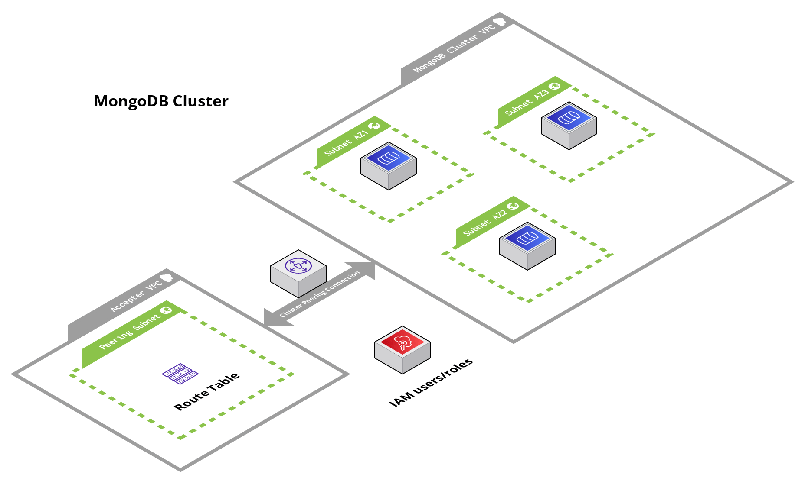

# Mongo Atlas Database Cluster (MongoDB)

## Overview

This module contains Terraform code to deploy a MongoDB Atlas database cluster.

This service launches a MongoDB cluster in AWS using the MongoDB Atlas provider. The cluster supports autoscaling, backups, automated patches.

<!-- Image or Arch diagram -->



## Learn

<!-- A few references to MongoDB (documentation, blog, etc...) -->

MongoDB is a no-sql database that is used to store data as documents in a JSON-like format. It is a popular database for web applications and is used by companies such as Facebook, Google, eBay, and us!

In regards to the supporting infrastructure, the MongoDB Atlas provider is a PaaS that allows us to deploy fully managed MongoDB clusters in AWS. The provider is responsible for managing the underlying infrastructure, such as EC2 instances, EBS volumes, and VPCs. The provider also handles the installation, configuration, and maintenance of MongoDB on the cluster.

In this module, the provided inputs allow us to easily enable features such as autoscaling, backups, automated patches.

For more information on MongoDB, see the following links:

- [Three Member Replica Sets](https://www.mongodb.com/docs/manual/core/replica-set-architecture-three-members/)
- [MongoDB AWS Reference](https://www.mongodb.com/docs/atlas/reference/amazon-aws/)

<!-- BEGIN_TF_DOCS -->
## Requirements

The following requirements are needed by this module:

- <a name="requirement_terraform"></a> [terraform](#requirement\_terraform) (>= 1.5.5)

- <a name="requirement_mongodbatlas"></a> [mongodbatlas](#requirement\_mongodbatlas) (>= 1.12.1)
## Sample Usage
```hcl
terraform {
	 source = "github.com/Cyber4All/terraform-cyber4all-catalog//modules/<REPLACE_WITH_MODULE>?ref=v<REPLACE_WITH_VERSION>"
}

inputs = {


	 # --------------------------------------------
	 # Required variables
	 # --------------------------------------------


	 cluster_name  = string


	 project_name  = string


	 # --------------------------------------------
	 # Optional variables
	 # --------------------------------------------


	 cluster_disk_size_gb  = number


	 cluster_instance_name  = string


	 cluster_mongodb_version  = string


	 cluster_region  = string


	 enable_cluster_auto_scaling  = bool


	 enable_cluster_automated_patches  = bool


	 enable_cluster_backups  = bool


	 enable_cluster_terimination_protection  = bool


	 enable_retain_deleted_cluster_backups  = bool


}
```
## Required Inputs

The following input variables are required:

### <a name="input_cluster_name"></a> [cluster\_name](#input\_cluster\_name)

Description: Name of the cluster as it appears in Atlas. Once the cluster is created, its name cannot be changed. WARNING: Changing the name will result in destruction of the existing cluster and the creation of a new cluster.

Type: `string`

### <a name="input_project_name"></a> [project\_name](#input\_project\_name)

Description: Name of the project as it appears in Atlas to deploy the cluster into.

Type: `string`

## Optional Inputs

The following input variables are optional (have default values):

### <a name="input_cluster_disk_size_gb"></a> [cluster\_disk\_size\_gb](#input\_cluster\_disk\_size\_gb)

Description: Capacity, in gigabytes, of the host's root volume. Increase this number to add capacity, up to a maximum possible value of 4096 (i.e., 4 TB). This value must be a positive integer.

Type: `number`

Default: `10`

### <a name="input_cluster_instance_name"></a> [cluster\_instance\_name](#input\_cluster\_instance\_name)

Description: The Atlas instance size name. Each Atlas instance size has a unique combination of memory, and storage capacity. See https://www.mongodb.com/docs/atlas/reference/amazon-aws/#cluster-configuration-options for more info.

Type: `string`

Default: `"M10"`

### <a name="input_cluster_mongodb_version"></a> [cluster\_mongodb\_version](#input\_cluster\_mongodb\_version)

Description: Version of the cluster to deploy. This module supports 4.4, 5.0, or 6.0. By default 5.0 is deployed.

Type: `string`

Default: `"5.0"`

### <a name="input_cluster_region"></a> [cluster\_region](#input\_cluster\_region)

Description: The AWS region to deploy the cluster into.

Type: `string`

Default: `"us-east-1"`

### <a name="input_enable_cluster_auto_scaling"></a> [enable\_cluster\_auto\_scaling](#input\_enable\_cluster\_auto\_scaling)

Description: Set to true to enable auto scaling for the cluster's compute and storage. Recommended for production clusters.

Type: `bool`

Default: `true`

### <a name="input_enable_cluster_automated_patches"></a> [enable\_cluster\_automated\_patches](#input\_enable\_cluster\_automated\_patches)

Description: Set to true to allow Atlas to automatically update your cluster to the latest patch release of the MongoDB version specified in the cluster\_mongodb\_version field.

Type: `bool`

Default: `true`

### <a name="input_enable_cluster_backups"></a> [enable\_cluster\_backups](#input\_enable\_cluster\_backups)

Description: Set to true to enable backups for the cluster. Recommended for production clusters.

Type: `bool`

Default: `true`

### <a name="input_enable_cluster_terimination_protection"></a> [enable\_cluster\_terimination\_protection](#input\_enable\_cluster\_terimination\_protection)

Description: Set to true to prevent terraform from deleting the Atlas cluster. Recommended for production clusters.

Type: `bool`

Default: `false`

### <a name="input_enable_retain_deleted_cluster_backups"></a> [enable\_retain\_deleted\_cluster\_backups](#input\_enable\_retain\_deleted\_cluster\_backups)

Description: Set to true to retain backup snapshots for the deleted cluster. Recommended for production clusters.

Type: `bool`

Default: `false`
## Outputs

The following outputs are exported:

### <a name="output_cluster_id"></a> [cluster\_id](#output\_cluster\_id)

Description: The mongodb cluster ID

### <a name="output_cluster_mongodb_base_uri"></a> [cluster\_mongodb\_base\_uri](#output\_cluster\_mongodb\_base\_uri)

Description: The base connection string for the cluster. The field is available only when the cluster is in an operational state.

### <a name="output_cluster_mongodb_uri_with_options"></a> [cluster\_mongodb\_uri\_with\_options](#output\_cluster\_mongodb\_uri\_with\_options)

Description: The connection string for the cluster with replicaSet, ssl, and authSource query parameters with values appropriate for the cluster. The field is available only when the cluster is in an operational state.

### <a name="output_cluster_mongodb_version"></a> [cluster\_mongodb\_version](#output\_cluster\_mongodb\_version)

Description: The mongodb cluster version

### <a name="output_cluster_state"></a> [cluster\_state](#output\_cluster\_state)

Description: The state that the cluster is in. Possible values are: IDLE, CREATING, UPDATING, DELETING, DELETED, REPAIRING.
<!-- END_TF_DOCS -->