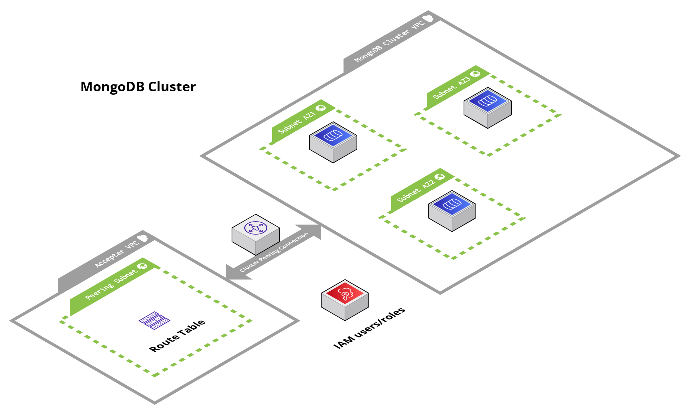

# Mongo Atlas Database Cluster (MongoDB)

## Overview

This module contains Terraform code to deploy a MongoDB Atlas database cluster.

This service launches a MongoDB cluster in AWS using the MongoDB Atlas provider. The cluster supports autoscaling, backups, automated patches, VPC peering, and IAM authentication.

<!-- Image or Arch diagram -->

## Learn

<!-- A few references to MongoDB (documentation, blog, etc...) -->

MongoDB is a no-sql database that is used to store data as documents in a JSON-like format. It is a popular database for web applications and is used by companies such as Facebook, Google, eBay, and us!

In regards to the supporting infrastructure, the MongoDB Atlas provider is a PaaS that allows us to deploy fully managed MongoDB clusters in AWS. The provider is responsible for managing the underlying infrastructure, such as EC2 instances, EBS volumes, and VPCs. The provider also handles the installation, configuration, and maintenance of MongoDB on the cluster.

In this module, the provided inputs allow us to easily enable features such as autoscaling, backups, automated patches, VPC peering, and IAM authentication.

For more information on MongoDB, see the following links:

- [Three Member Replica Sets](https://www.mongodb.com/docs/manual/core/replica-set-architecture-three-members/)
- [MongoDB AWS Reference](https://www.mongodb.com/docs/atlas/reference/amazon-aws/)
