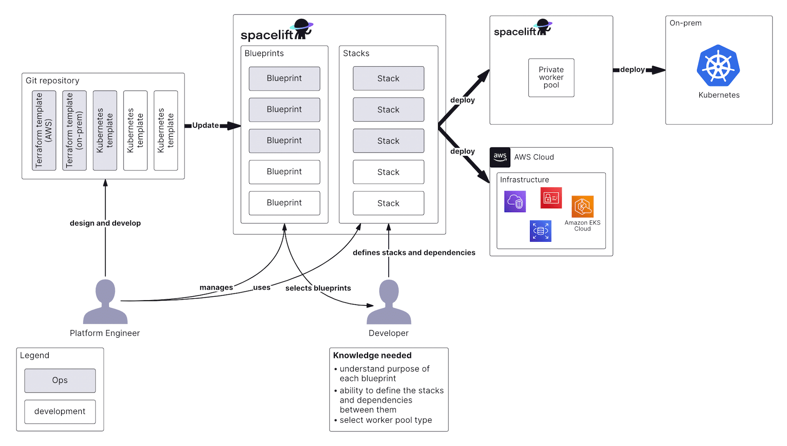

# Spacelift Stack

## Overview

This module is designed to create a stack and its supporting resources, enabling an opinionated Continuous Integration/Continuous Deployment (CICD) workflow on Spacelift. It provides the capability to create a Spacelift stack and optionally set up an IAM role for integration with AWS.



## Learn

This section will help you learn about the resources that are created by this module.

### Stack

A `Stack` is a fundamental resource within Spacelift, serving as a combination of source code, the current state of managed infrastructure (e.g., Terraform state files), and configuration in the form of environment variables and mounted files. Stacks are uniquely named per account, and it's recommended to follow a naming convention like `<environment>-<project>-<module>-<region>`. For instance, `dev-competency-vpc-us-east-1` or `dev-competency-api-ecs-service-us-east-1`. You have the flexibility to create a stack with or without state management. If state management is enabled, Spacelift will handle the storage of the Terraform state file. However, if state management is disabled, you should define an alternative remote backend, such as Amazon S3.

One powerful feature of Spacelift is the ability to define stack dependencies. This allows you to establish a dependency on another stack and reference its outputs. For instance, you can create a stack that relies on a VPC stack and references the VPC ID output from that stack. This module supports defining stack dependencies by providing a map of stack IDs and a map of environment variables linked to outputs from the referenced stack. For example, { "stack-id" = { "vpc_id" = "vpc_id" } }. The input name is automatically prefixed with `TF_VAR_`, which takes the output `vpc_id` from the stack with ID `stack-id` and sets it as an environment variable named `TF_VAR_vpc_id` for the stack you're managing. If the stack you depend on gets updated, it automatically triggers a run of the stack that relies on it.

For more in-depth information, you can refer to the[Spacelift stack documentation](https://docs.spacelift.io/concepts/stack/).

#### Admin Stack vs. Non-Admin Stack

An "admin stack" is a Spacelift stack with the capability to manage other stacks. This is particularly useful when defining a stack responsible for managing multiple stacks. You can create an admin stack by setting the `enable_admin_stack` variable to `true`. When an admin stack is created, it gains the authority to oversee other stacks.

A typical use case for an admin stack is to create a folder with a Terraform file for each stack you want the admin stack to manage. Then, implement the admin stack in a separate folder. You should provision the admin stack first, and it will automatically provision the other stacks it manages. This approach is beneficial when multiple stacks are needed to manage a single project. Ideally, there should be one admin stack per project per environment.

##### Organizing Stacks in Repository

To maintain a well-organized repository, consider arranging your stacks in a logical structure that aligns with your project's needs. A recommended approach is to create a dedicated folder for each stack and place the Terraform files for that stack within the corresponding folder. For example, if you have a project named `competency` and you need stacks for the `VPC`, `ECS service`, and ECS task definition, you can organize the stacks as follows:

```console
live/
	|- environment/
		|- spacelift/
			|- project/
				|- admin/
					|- backend.tf
					|- main.tf
					|- outputs.tf
				|- stacks/
					|- backend.tf
					|- gateway-ecs-service-us-east-1.tf
					|- api-ecs-service-us-east-1.tf
					|- vpc-us-east-1.tf
					|- alb-us-east-1.tf
					|- outputs.tf
```

### Additional Resources

[Why use Spacelift with Terraform?](https://docs.spacelift.io/vendors/terraform/)

<!-- BEGIN_TF_DOCS -->
## Requirements

The following requirements are needed by this module:

- <a name="requirement_terraform"></a> [terraform](#requirement\_terraform) (>= 1.5.5)

- <a name="requirement_aws"></a> [aws](#requirement\_aws) (>= 5.0)

- <a name="requirement_spacelift"></a> [spacelift](#requirement\_spacelift) (>= 1.6.0)

## Sample Usage

```hcl
module "example" {


	 source  = "github.com/Cyber4All/terraform-cyber4all-catalog//modules/<REPLACE_WITH_MODULE>?ref=v<REPLACE_WITH_VERSION>"


	 # --------------------------------------------
	 # Required variables
	 # --------------------------------------------


	 # GitHub branch to apply changes to
	 branch  = string


	 # Name of the repository, without the owner slug prefix
	 repository  = string


	 # Name of the stack - should be unique in one account. A naming convention of <environment>-<project>-<module>-<region> is recommended.
	 stack_name  = string


	 # --------------------------------------------
	 # Optional variables
	 # --------------------------------------------


	 # List of Spacelift context IDs to attach to the stack
	 context_ids  = list(string)


	 # Description of the stack
	 description  = string


	 # Whether to enable administrative access to the stack to manage other Spacelift stacks and resources. Automically disables IAM integration.
	 enable_admin_stack  = bool


	 # Whether to enable automatic apply of changes to the stack
	 enable_autodeploy  = bool


	 # Whether to enable an IAM role to be created for the stack.
	 enable_iam_integration  = bool


	 # Whether to protect the stack from deletion. This value should only be changed if you understand the implications of doing so.
	 enable_protect_from_deletion  = bool


	 # Whether to enable state management for the stack. If disabled, the implementation of the module should define another remote backend such as S3.
	 enable_state_management  = bool


	 # Stack scoped environment variables to set for the stack. These variables will be available to all Terraform runs for the stack. All variables will be prefixed automatically with TF_VAR_.
	 environment_variables  = map(string)


	 # IAM role policy ARNs to attach to the stack's IAM role. The IAM role will be created if create_iam_role is true. The policies ARNs can either be ARNs of AWS managed policies or custom policies.
	 iam_role_policy_arns  = list(string)


	 # Labels to assign to the stack.
	 labels  = list(string)


	 # Path to the root of the project
	 path  = string


	 # List of Spacelift policy IDs to attach to the stack
	 policy_ids  = list(string)


	 # A map of stack ids that this stack depends on. The key is the stack id and the value is a map of environment variables that are defined by outputs of the stack. i.e { "stack-id" = { "vpc_id" = "vpc_id" } }. The input name is automatically prefixed with TF_VAR_.
	 stack_dependencies  = map(any)


	 # Terraform version to use, if not set it will default to t0 version 1.5.5
	 terraform_version  = string


}
```
## Required Inputs

The following input variables are required:

### <a name="input_branch"></a> [branch](#input\_branch)

Description: GitHub branch to apply changes to

Type: `string`

### <a name="input_repository"></a> [repository](#input\_repository)

Description: Name of the repository, without the owner slug prefix

Type: `string`

### <a name="input_stack_name"></a> [stack\_name](#input\_stack\_name)

Description: Name of the stack - should be unique in one account. A naming convention of <environment>-<project>-<module>-<region> is recommended.

Type: `string`

## Optional Inputs

The following input variables are optional (have default values):

### <a name="input_context_ids"></a> [context\_ids](#input\_context\_ids)

Description: List of Spacelift context IDs to attach to the stack

Type: `list(string)`

Default: `[]`

### <a name="input_description"></a> [description](#input\_description)

Description: Description of the stack

Type: `string`

Default: `"A stack managed by Terraform"`

### <a name="input_enable_admin_stack"></a> [enable\_admin\_stack](#input\_enable\_admin\_stack)

Description: Whether to enable administrative access to the stack to manage other Spacelift stacks and resources. Automically disables IAM integration.

Type: `bool`

Default: `false`

### <a name="input_enable_autodeploy"></a> [enable\_autodeploy](#input\_enable\_autodeploy)

Description: Whether to enable automatic apply of changes to the stack

Type: `bool`

Default: `false`

### <a name="input_enable_iam_integration"></a> [enable\_iam\_integration](#input\_enable\_iam\_integration)

Description: Whether to enable an IAM role to be created for the stack.

Type: `bool`

Default: `true`

### <a name="input_enable_protect_from_deletion"></a> [enable\_protect\_from\_deletion](#input\_enable\_protect\_from\_deletion)

Description: Whether to protect the stack from deletion. This value should only be changed if you understand the implications of doing so.

Type: `bool`

Default: `true`

### <a name="input_enable_state_management"></a> [enable\_state\_management](#input\_enable\_state\_management)

Description: Whether to enable state management for the stack. If disabled, the implementation of the module should define another remote backend such as S3.

Type: `bool`

Default: `false`

### <a name="input_environment_variables"></a> [environment\_variables](#input\_environment\_variables)

Description: Stack scoped environment variables to set for the stack. These variables will be available to all Terraform runs for the stack. All variables will be prefixed automatically with TF\_VAR\_.

Type: `map(string)`

Default: `{}`

### <a name="input_iam_role_policy_arns"></a> [iam\_role\_policy\_arns](#input\_iam\_role\_policy\_arns)

Description: IAM role policy ARNs to attach to the stack's IAM role. The IAM role will be created if create\_iam\_role is true. The policies ARNs can either be ARNs of AWS managed policies or custom policies.

Type: `list(string)`

Default:

```json
[
  "arn:aws:iam::aws:policy/AdministratorAccess"
]
```

### <a name="input_labels"></a> [labels](#input\_labels)

Description: Labels to assign to the stack.

Type: `list(string)`

Default: `[]`

### <a name="input_path"></a> [path](#input\_path)

Description: Path to the root of the project

Type: `string`

Default: `null`

### <a name="input_policy_ids"></a> [policy\_ids](#input\_policy\_ids)

Description: List of Spacelift policy IDs to attach to the stack

Type: `list(string)`

Default: `[]`

### <a name="input_stack_dependencies"></a> [stack\_dependencies](#input\_stack\_dependencies)

Description: A map of stack ids that this stack depends on. The key is the stack id and the value is a map of environment variables that are defined by outputs of the stack. i.e { "stack-id" = { "vpc\_id" = "vpc\_id" } }. The input name is automatically prefixed with TF\_VAR\_.

Type: `map(any)`

Default: `{}`

### <a name="input_terraform_version"></a> [terraform\_version](#input\_terraform\_version)

Description: Terraform version to use, if not set it will default to t0 version 1.5.5

Type: `string`

Default: `"1.5.5"`
## Outputs

The following outputs are exported:

### <a name="output_dependency_mappings"></a> [dependency\_mappings](#output\_dependency\_mappings)

Description: A list of maps of stack dependency id to the variable mappings defined in the stack\_dependencies variable

### <a name="output_number_of_dependencies"></a> [number\_of\_dependencies](#output\_number\_of\_dependencies)

Description: The number of stack dependencies

### <a name="output_number_of_output_references"></a> [number\_of\_output\_references](#output\_number\_of\_output\_references)

Description: The number of variable mappings defined in the stack\_dependencies variable

### <a name="output_stack_iam_role_arn"></a> [stack\_iam\_role\_arn](#output\_stack\_iam\_role\_arn)

Description: The ARN of the stack's IAM role

### <a name="output_stack_iam_role_id"></a> [stack\_iam\_role\_id](#output\_stack\_iam\_role\_id)

Description: The id of the stack's IAM role

### <a name="output_stack_iam_role_policy_arns"></a> [stack\_iam\_role\_policy\_arns](#output\_stack\_iam\_role\_policy\_arns)

Description: The ARNs of the stack's IAM role policies

### <a name="output_stack_id"></a> [stack\_id](#output\_stack\_id)

Description: The id of the stack
<!-- END_TF_DOCS -->