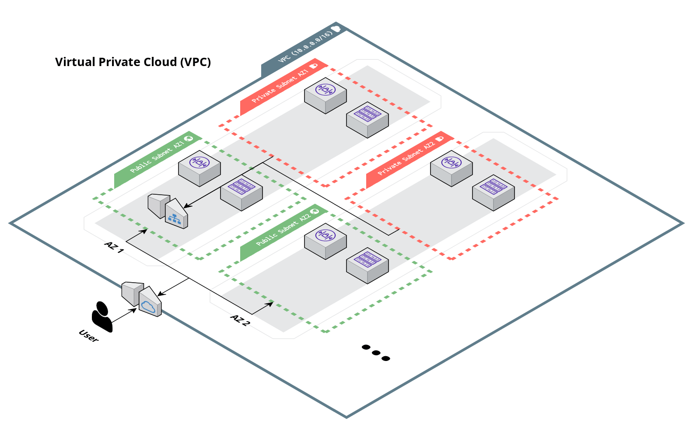

# Virtual Private Cloud (VPC)

## Overview

This module contains Terraform code to deploy a VPC on [AWS](https://aws.amazon.com/) using [Virtual Private Cloud (VPC)](https://docs.aws.amazon.com/vpc/latest/userguide/what-is-amazon-vpc.html).

The module creates a single VPC with public and private subnets in multiple availability zone. The public subnets are used for resources that need to be publicly accessible, such as load balancers. The private subnets are used for resources that should not be publicly accessible, such as backend APIs.



## Learn

VPC is a fundamental building block of AWS. It allows you to create a virtual network in the cloud that is isolated from other virtual networks. You can then launch AWS resources, such as ECS cluster, into your VPC. You can also connect your VPC to databases deployed in a different VPC using [VPC peering](https://docs.aws.amazon.com/vpc/latest/peering/what-is-vpc-peering.html).

To learn more about VPC, see the following resources:
- [VPC Subnets](https://docs.aws.amazon.com/vpc/latest/userguide/configure-subnets.html#subnet-basics)
- [VPC Routing](https://docs.aws.amazon.com/vpc/latest/userguide/VPC_Route_Tables.html)
- [VPC NACLs](https://docs.aws.amazon.com/vpc/latest/userguide/vpc-network-acls.html)
- [VPC NAT Gateways](https://docs.aws.amazon.com/vpc/latest/userguide/vpc-nat-gateway.html)
- [VPC Peering](https://docs.aws.amazon.com/vpc/latest/peering/what-is-vpc-peering.html)

<!-- BEGIN_TF_DOCS -->
## Requirements

The following requirements are needed by this module:

- <a name="requirement_terraform"></a> [terraform](#requirement\_terraform) (>= 1.5.5)

- <a name="requirement_aws"></a> [aws](#requirement\_aws) (>= 5.0)
## Sample Usage
```hcl
terraform {
	 source = "github.com/Cyber4All/terraform-cyber4all-catalog//modules/<REPLACE_WITH_MODULE>?ref=v<REPLACE_WITH_VERSION>"
}

inputs = {


	 # --------------------------------------------
	 # Required variables
	 # --------------------------------------------


	 vpc_name  = string


	 # --------------------------------------------
	 # Optional variables
	 # --------------------------------------------


	 create_nat_gateway  = bool


	 create_private_subnets  = bool


	 create_public_subnets  = bool


	 num_availability_zones  = number


}
```
## Required Inputs

The following input variables are required:

### <a name="input_vpc_name"></a> [vpc\_name](#input\_vpc\_name)

Description: The name of the VPC.

Type: `string`

## Optional Inputs

The following input variables are optional (have default values):

### <a name="input_create_nat_gateway"></a> [create\_nat\_gateway](#input\_create\_nat\_gateway)

Description: Whether or not to create a NAT gateway.

Type: `bool`

Default: `true`

### <a name="input_create_private_subnets"></a> [create\_private\_subnets](#input\_create\_private\_subnets)

Description: Whether or not to create private subnets.

Type: `bool`

Default: `true`

### <a name="input_create_public_subnets"></a> [create\_public\_subnets](#input\_create\_public\_subnets)

Description: Whether or not to create public subnets.

Type: `bool`

Default: `true`

### <a name="input_num_availability_zones"></a> [num\_availability\_zones](#input\_num\_availability\_zones)

Description: How many AWS Availability Zones (AZs) to use. One subnet of each type (public, private app) will be created in each AZ. Note that this must be less than or equal to the total number of AZs in a region. A value of null means all AZs should be used. For example, if you specify 3 in a region with 5 AZs, subnets will be created in just 3 AZs instead of all 5. Defaults to all AZs in a region.

Type: `number`

Default: `null`
## Outputs

The following outputs are exported:

### <a name="output_availability_zones"></a> [availability\_zones](#output\_availability\_zones)

Description: The availability zones of the VPC.

### <a name="output_nat_gateway_public_ip"></a> [nat\_gateway\_public\_ip](#output\_nat\_gateway\_public\_ip)

Description: The public IP address of the NAT gateways.

### <a name="output_num_availability_zones"></a> [num\_availability\_zones](#output\_num\_availability\_zones)

Description: The number of availability zones of the VPC.

### <a name="output_num_nat_gateways"></a> [num\_nat\_gateways](#output\_num\_nat\_gateways)

Description: The number of NAT gateways created.

### <a name="output_private_subnet_cidr_blocks"></a> [private\_subnet\_cidr\_blocks](#output\_private\_subnet\_cidr\_blocks)

Description: The CIDR blocks of the private subnets.

### <a name="output_private_subnet_ids"></a> [private\_subnet\_ids](#output\_private\_subnet\_ids)

Description: The IDs of the private subnets.

### <a name="output_private_subnet_route_table_id"></a> [private\_subnet\_route\_table\_id](#output\_private\_subnet\_route\_table\_id)

Description: The ID of the private subnet route table.

### <a name="output_private_subnets"></a> [private\_subnets](#output\_private\_subnets)

Description: A map of all private subnets, with the subnet name as key, and all aws-subnet properties as the value.

### <a name="output_public_subnet_cidr_blocks"></a> [public\_subnet\_cidr\_blocks](#output\_public\_subnet\_cidr\_blocks)

Description: The CIDR blocks of the public subnets.

### <a name="output_public_subnet_ids"></a> [public\_subnet\_ids](#output\_public\_subnet\_ids)

Description: The IDs of the public subnets.

### <a name="output_public_subnet_route_table_id"></a> [public\_subnet\_route\_table\_id](#output\_public\_subnet\_route\_table\_id)

Description: The ID of the public subnet route table.

### <a name="output_public_subnets"></a> [public\_subnets](#output\_public\_subnets)

Description: A map of all public subnets, with the subnet name as key, and all aws-subnet properties as the value.

### <a name="output_public_subnets_network_acl_id"></a> [public\_subnets\_network\_acl\_id](#output\_public\_subnets\_network\_acl\_id)

Description: The ID of the public subnet network ACL.

### <a name="output_vpc_cidr_block"></a> [vpc\_cidr\_block](#output\_vpc\_cidr\_block)

Description: The CIDR block of the VPC.

### <a name="output_vpc_id"></a> [vpc\_id](#output\_vpc\_id)

Description: The ID of the VPC.

### <a name="output_vpc_name"></a> [vpc\_name](#output\_vpc\_name)

Description: The name of the VPC.
<!-- END_TF_DOCS -->